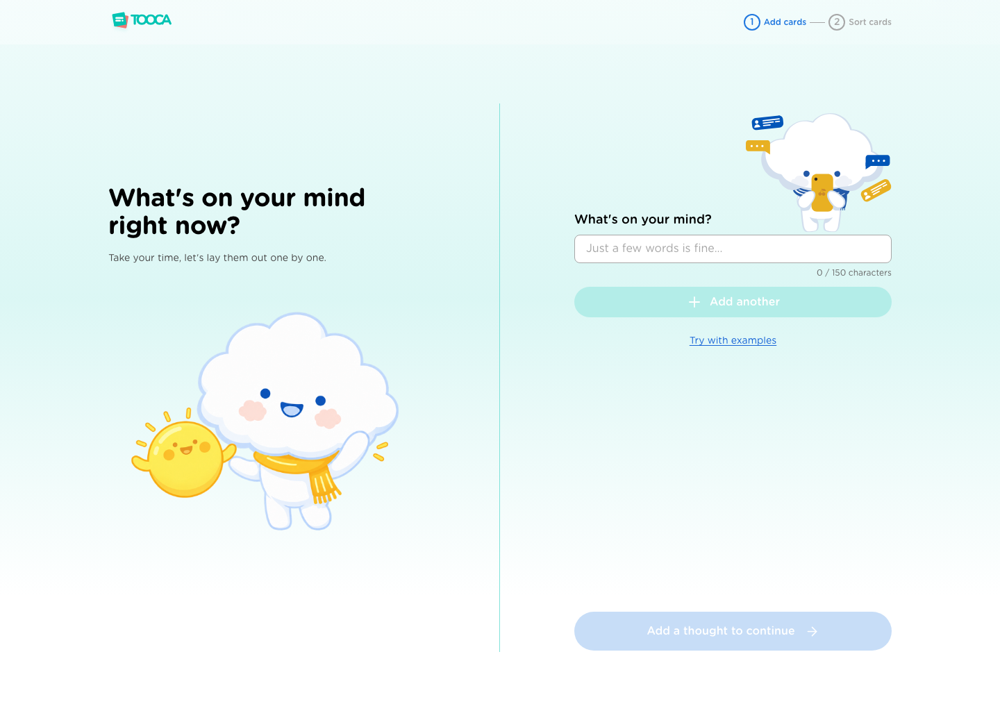
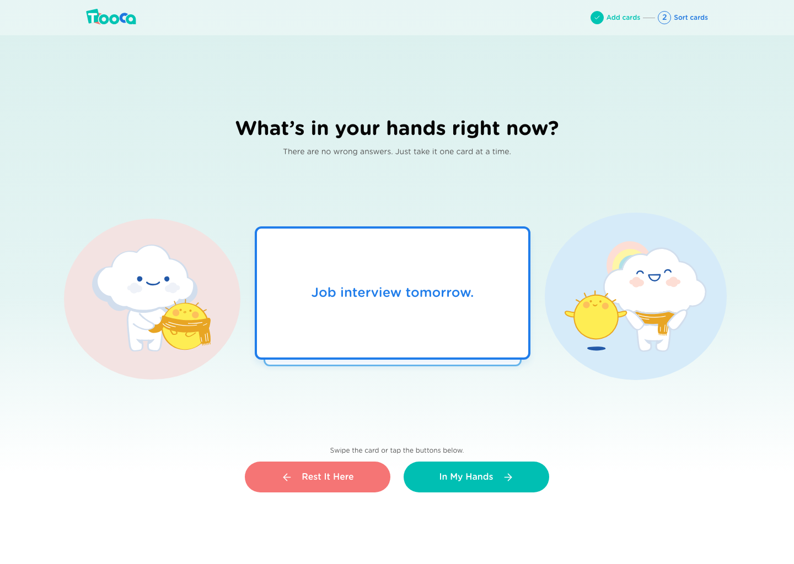
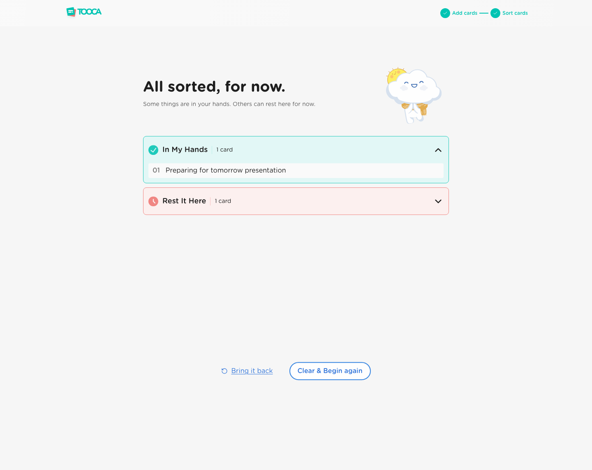
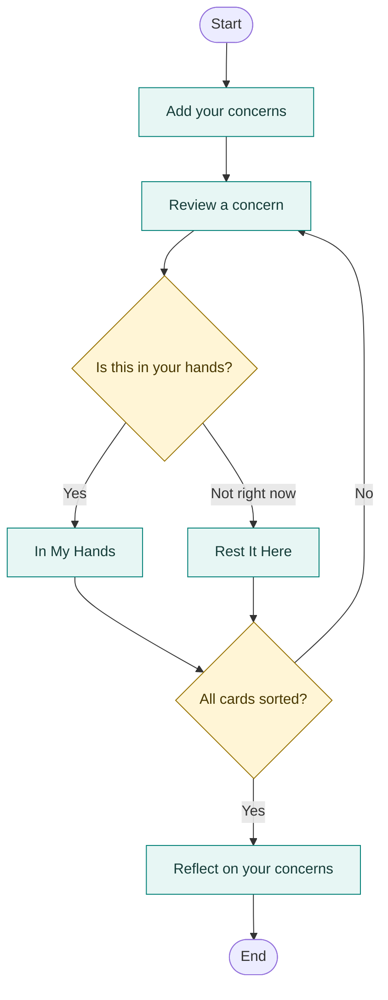
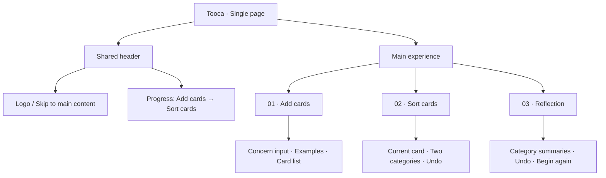

<p align="center">
  
</p>

# Tooca

**Make room for what is in your hands.**

A gentle, interactive space to put worries into words, sort them one at a time, and reflect on what can be acted on now.

**[Try the live demo → tooca-ooca.vercel.app](https://tooca-ooca.vercel.app/)**

[Product & experience](docs/product.md) · [Architecture & state](docs/architecture.md) · [Development & design system](docs/development.md) · [Design QA](design-qa.md)

## Why Tooca?

| The problem | The audience | The approach |
| :--- | :--- | :--- |
| Under stress, the boundary between what we can and cannot control can feel blurred. Tangled concerns can feed overthinking and overwhelm. | Working professionals and students facing immediate stressors who want a quick moment of mindfulness and a way to approach concerns one at a time. | Turn the **Circle of Control** concept into a simple card-sorting experience: write, swipe, and reflect. |

The design hypothesis is that a physical sorting action can help people move from repeatedly thinking about a worry to making a concrete choice about it. Tooca uses gentle, game-like interaction without scores or time pressure. This is the product rationale, not a measured claim of clinical effectiveness.

## The experience at a glance

| 01 · Add | 02 · Sort | 03 · Reflect |
| :---: | :---: | :---: |
|  |  |  |
| **Put it into words.** | **Make one choice at a time.** | **See what is in your hands.** |
| Write a concern or try a random example. | Swipe left to rest it here, or right to keep it in your hands. Buttons offer the same choices. | Review both groups, bring a card back, or begin again. |

*Screenshots are saved design-review captures. Some colors, copy, and mascot states have changed since capture; see [Design QA](design-qa.md).*

## Core user flow



Rounded nodes mark the start and end, rectangles show activities, and diamonds show decisions. Optional undo and restart paths are covered in the [experience guide](docs/product.md#interaction-rules).

## Information architecture

One application page contains three experience states. The header shows **Add cards** and **Sort cards**; reflection is the outcome of sorting.



This is a content hierarchy, not a route map. See [state and navigation](docs/architecture.md#state-and-navigation) for implementation details.

## Run locally

Use **Node.js 22.12+** and **npm 11+**.

```bash
git clone https://github.com/AranGit/tooca.git
cd tooca
npm ci
npm run dev
```

Open the local URL printed by Vite. No environment variables, account, or backend setup are required.

| Explore | Command |
| :--- | :--- |
| Component stories | `npm run storybook` |
| Unit tests | `npm run test:run` |
| Type, lint, and token checks | `npm run typecheck && npm run lint && npm run tokens:check` |
| Production build | `npm run build` |
| Preview production build | `npm run preview` |

Browser checks and Storybook accessibility tests require Chromium. See [complete setup and verification](docs/development.md).

## Built with

| Interface | Interaction & state | Quality & tooling |
| :--- | :--- | :--- |
| React 19 · TypeScript · Tailwind CSS 4 | Motion · Zustand · sessionStorage | Vite · Vitest · Testing Library · Storybook · Playwright · Oxlint |

**Session behavior:** cards, categories, and sorting history survive refreshes in the same tab. The Add cards list shows the newest card first, while sorting and reflection retain the original entry order. Unsubmitted text and accordion expansion are temporary. The app has no backend or cross-device synchronization; **Begin again** clears the current session.

**Known accessibility issue:** the supplied sorting colors have recorded contrast failures. Automated accessibility checks remain enabled. See the [QA findings](design-qa.md#open-accessibility-finding) before treating this as accessibility-complete.

## Documentation map

| Read this | To understand |
| :--- | :--- |
| [Product & experience](docs/product.md) | Problem, audience, design rationale, interactions, and scope |
| [Architecture & state](docs/architecture.md) | Page structure, state transitions, persistence, and source ownership |
| [Development & design system](docs/development.md) | Setup, commands, tokens, fonts, assets, and verification |
| [Design QA](design-qa.md) | Saved visual evidence, review history, and unresolved contrast findings |
