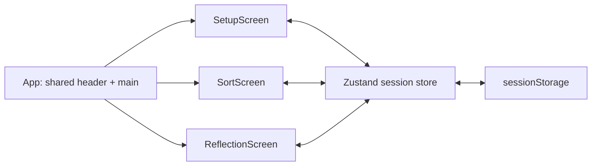
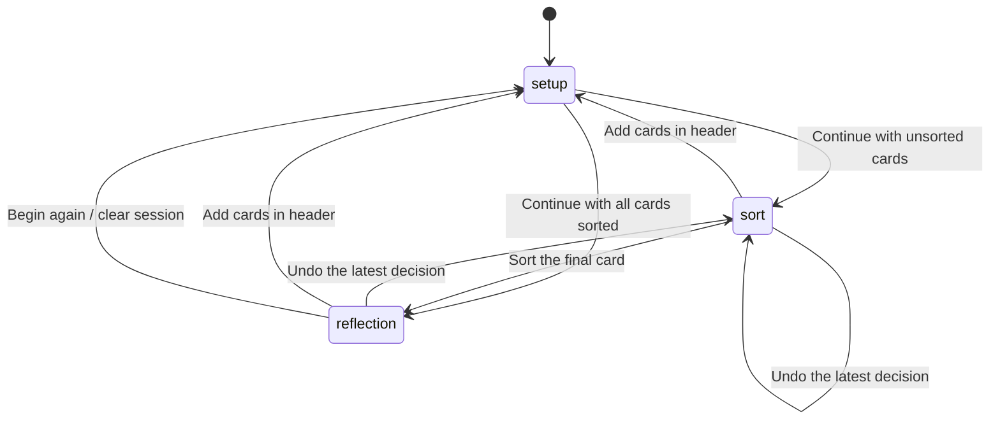

# Architecture & state

[← README](../README.md) · [Product](product.md) · [Development](development.md)

## One page, three states



[App.tsx](../src/App.tsx) renders one screen according to `phase`. Motion animates transitions between screens and respects reduced-motion preferences.

## State and navigation



The diagram starts from a fresh session. Reloading restores a valid saved phase instead.

There is no router dependency or separate URL for each step. `#main` is an in-page main-content anchor. Browser Back does not traverse sorting decisions; the app provides **Bring it back** and the header's **Add cards** action for navigation.

The progress indicator has two labels: Add cards and Sort cards. Both are complete during reflection. Sort cards is a status label, not a navigation button.

## State ownership

| State | Owner | Survives refresh? |
| :--- | :--- | :--- |
| Phase, cards, categories, decision history | [Zustand store](../src/store/session.ts) | Yes, in the same tab |
| Unsubmitted input | SetupScreen local state | No |
| Card drag position, animation lock, dragging state | SortTurn local state and Motion values | No |
| Expanded summary groups | ReflectionScreen local state | No |
| Pending cards and category groups | Derived from stored cards | Recomputed |

Zustand lets the screens and shared header act on the same session without passing actions through every component. Temporary interaction state stays close to the component that uses it.

## Data model

```typescript
type Phase = 'setup' | 'sort' | 'reflection'
type Category = 'in-my-hands' | 'rest-it-here'

interface Thought {
  id: string
  text: string
  category: Category | null
}

interface SortDecision {
  thoughtId: string
  previousCategory: Category | null
  nextCategory: Category
}
```

Cards receive UUIDs. A null category means unsorted. Sorting appends a decision to history; undo removes the latest decision and restores that card's previous category. The displayed pending card is the first uncategorized card in original entry order.

## Persistence and safeguards

- The storage key is `tooca-session`, schema version `1`.
- Only `phase`, `thoughts`, and `history` are persisted.
- Hydration filters invalid card records and invalid history entries, then reconciles the phase with the remaining cards.
- Returning to setup retains existing categories. New cards start uncategorized.
- Empty sessions cannot enter sorting; fully categorized sessions continue to reflection.
- Sorting accepts only an existing, uncategorized card while in the sort phase.
- A local animation lock prevents rapid clicks from recording multiple decisions during a card exit.
- Begin again resets the stored session. There is no server persistence or cross-device sync.

The store also exposes `restartSorting`, which clears categories and history while keeping card text. It is currently not connected to a user-facing control; **Begin again** uses `resetSession` instead.

## Source map

```text
src/
├── App.tsx                 Shared shell and phase rendering
├── features/
│   ├── flow/               Shared layout, header, setup styles
│   ├── setup/              Concern entry and mock examples
│   ├── sort/               Swipe interaction and undo
│   └── reflection/         Category summaries and reset
├── store/session.ts        Session model, transitions, persistence
├── components/Button/      Reusable button and stories
├── stories/                Design foundations stories
├── styles/                 Fonts, foundations, generated tokens
├── assets/                 Brand, mascots, bundled fonts
└── test/                   Unit-test setup
```
