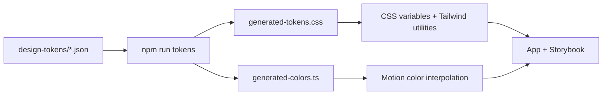

# Development & design system

[← README](../README.md) · [Product](product.md) · [Architecture](architecture.md) · [Design QA](../design-qa.md)

## Setup

Use Node.js 22.12 or newer and npm 11 or newer. Run commands from the repository root.

```bash
npm ci
npm run dev
```

Vite prints the application URL. The app needs no `.env` file or backend. For component development, run `npm run storybook` and open the URL it prints (port 6006 by default).

## Command reference

| Command | Purpose |
| :--- | :--- |
| `npm run dev` | Generate tokens and start Vite |
| `npm run build` | Generate tokens, compile TypeScript, and build to `dist/` |
| `npm run preview` | Serve the existing production build locally |
| `npm run typecheck` | Check TypeScript project references |
| `npm run lint` | Run Oxlint on source, stories, scripts, and configs |
| `npm run tokens` | Regenerate CSS tokens and TypeScript color constants |
| `npm run tokens:check` | Check raw application colors and corner radii |
| `npm test` | Start Vitest in watch mode |
| `npm run test:run` | Run the unit-test project |
| `npm run test:storybook` | Run Storybook browser tests and accessibility checks |
| `npm run storybook` | Generate tokens and start Storybook |
| `npm run build-storybook` | Generate tokens and build to `storybook-static/` |

## Design token pipeline



| Foundation | Source | Usage |
| :--- | :--- | :--- |
| Colors | [color-tokens.json](../design-tokens/color-tokens.json) | CSS variables, Tailwind colors, Motion constants |
| Corner radii | [border-radius-tokens.json](../design-tokens/border-radius-tokens.json) | CSS variables and Tailwind radius utilities |
| Typography and elevation | [foundations.css](../src/styles/foundations.css) | Shared type and shadow definitions |
| Fonts | [fonts.css](../src/styles/fonts.css) and [bundled files](../src/assets/fonts) | Gotham Rounded weights |
| Shared stylesheet | [index.css](../src/index.css) | Imported by both the app and Storybook |

Edit the token JSON, then run `npm run tokens`. Commit the regenerated [CSS](../src/styles/generated-tokens.css) and [TypeScript colors](../src/styles/generated-colors.ts) with the source changes; do not edit generated files directly. Generation also runs automatically before app and Storybook development/build commands.

Examples: `bg-primary-500`, `text-gray-900`, `rounded-sm`, `shadow-elevation-04`, or `var(--color-primary-500)` in CSS. Motion uses imports from `generated-colors.ts` when it needs interpolatable color values.

The audit checks application CSS and TypeScript for raw colors and corner radii. It is not a general spacing or typography linter. Layout measurements remain in component styles; typography and elevation are defined in the foundations stylesheet.

## Visual assets

| Asset | Location |
| :--- | :--- |
| Tooca logo | [src/assets/brand](../src/assets/brand) |
| Mooca illustrations | [src/assets/mascot](../src/assets/mascot) |
| Gotham Rounded fonts | [src/assets/fonts](../src/assets/fonts) |
| Browser favicon | [public/favicon.svg](../public/favicon.svg) |

Import component assets from `src/assets` so Vite can fingerprint them. The supplied fonts and artwork are bundled for this project; this repository does not establish permission for unrelated reuse.

## Verification

For application changes, run the checks relevant to the changed behavior:

```bash
npm run typecheck
npm run lint
npm run tokens:check
npm run test:run
npm run build
```

Install the browser runtime before Storybook or browser verification:

```bash
npx playwright install chromium
npm run test:storybook
npm run build-storybook
```

Storybook accessibility checks use `test: 'error'`. Sorting has previously recorded color-contrast failures; see [the open finding](../design-qa.md#open-accessibility-finding). A successful build does not mean accessibility checks passed.

### Sorting browser check

Start the app on the exact port used by the script:

```bash
npm run dev -- --host 127.0.0.1 --port 4173 --strictPort
```

In another terminal:

```bash
TOOCA_QA_OUTPUT=/tmp/tooca-sort-qa node scripts/verify-sort.mjs
```

The script checks drag colors, both swipe directions, cancelled drags, undo, refresh, repeated-click protection, completion, reduced motion, responsive layout, a 150-character card on mobile, a short laptop viewport, and runtime errors. It saves screenshots to the selected output folder. Without the override, it writes into `qa/step2-full`, replacing saved evidence with matching filenames.

### Manual review

| Area | Check |
| :--- | :--- |
| Setup | Empty input, long concern, examples, remove, long list, continue |
| Sorting | Left/right buttons and swipes, short drag, undo, final card |
| Reflection | Both groups, empty group, long text, undo, reset |
| Persistence | Refresh each phase; return to setup and add another card |
| Responsive layout | Desktop, intermediate widths, narrow and short mobile viewports |
| Accessibility | Keyboard buttons, visible focus, labels, reduced motion, contrast |

The saved [QA report](../design-qa.md) is review history, not evidence that the current checkout has just passed every check.
