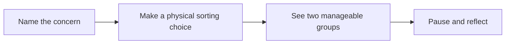

# Product & experience

[← README](../README.md) · [Architecture](architecture.md) · [Development](development.md) · [Design QA](../design-qa.md)

## The problem

Under stress, people can blur the lines between what they can control and what they cannot. Concerns become entangled, feeding a loop of overthinking that can leave a person feeling overwhelmed.

Tooca is designed around one immediate need: **help me separate these thoughts so I can approach them one at a time.**

## Target audience

Tooca focuses on adults and older students who are experiencing everyday stress or overthinking. It is a self-guided reflection tool, not a diagnostic, crisis, or treatment service.

| Audience | Immediate context | Intended value |
| :--- | :--- | :--- |
| University students | A presentation, deadline, application, workload, or social concern | A simple way to name worries and decide what deserves attention now |
| Early-career and working professionals | An interview, deadline, difficult conversation, unanswered message, or work-life pressure | A short pause to distinguish personal actions from uncertain outcomes |

### Research basis

The audience definition is grounded in recent Thai research and workforce data. These sources indicate a need for accessible, low-pressure support; they do not establish that Tooca reduces stress or treats a mental-health condition.

| Source | Relevant finding | Design implication |
| :--- | :--- | :--- |
| [Jaikham et al. (2025), *Stress Among Freshmen Students at Chiang Rai Rajabhat University*](https://so02.tci-thaijo.org/index.php/larts-journal/article/view/274519) | In a stratified sample of 400 first-year students, 43.5% reported severe stress. The finding is specific to this university sample. | Prioritize academic deadlines, presentations, workload, and social concerns in examples and usability testing. |
| [Thanasupawat et al. (2025), *Factors Affecting Stress and Stress Management of Students*](https://so08.tci-thaijo.org/index.php/dhammalife/article/view/5377) | A study of 335 education students found health and environmental factors significantly associated with stress. | Keep the activity short, private, and usable across varying study environments. |
| [Gallup, *State of the Global Workplace: Thailand*](https://www.gallup.com/workplace/707378/state-global-workplace-thailand-country-level-data.aspx) | For 2025, 25% of Thai employees said they experienced a lot of stress the previous day. The report was published in 2026 using 2025 data. | Support short, in-the-moment use around work pressure rather than requiring a long wellness session. |
| [Thai Health Report 2025](https://www.thaihealth.or.th/p/08MmLMvL3) | ThaiHealth and Mahidol University frame mental health as a national public-health concern; the report cites 13.4 million Thai people who have experienced a mental-health problem or psychiatric condition at least once. | Use non-stigmatizing language and retain clear boundaries between reflective support and professional care. |

All cited publications or datasets are from 2025 onward. The student studies are not national prevalence estimates, so they should be used as context for the selected audience rather than as claims about all Thai students.

### UX/UI feedback survey

[Tooca UX/UI Feedback Survey](https://forms.gle/kHDn2k6e9cXh1Jfy9) collects user feedback on the product experience. It is an evaluation instrument for testing the design hypothesis and should not be presented as published research or evidence of clinical effectiveness. Feedback from the survey can be used to assess comprehension of the two categories, ease of completing the flow, perceived usefulness, and opportunities to improve the interface.

## The approach

Tooca adapts the **Circle of Control** concept into an intuitive, game-like interaction. Users externalize a concern as a card, then physically swipe left or right to choose where it belongs. Each choice is reversible.

The interaction is intended to interrupt passive rumination by giving the user a concrete action. That mechanism is a design hypothesis; this repository does not establish that swiping reduces anxiety more effectively than other approaches.

| Principle | How it appears in Tooca |
| :--- | :--- |
| Keep the task small | One concern per card; one card at a time during sorting |
| Let the user decide | No automatic classification or right/wrong judgment |
| Allow reconsideration | **Bring it back** undoes the latest decision |
| Offer a gentle starting point | **Try with examples** adds one random concern |
| Avoid pressure | No score, timer, streak, or ranking |
| Give closure without finality | **All sorted, for now.** and **Clear & Begin again** |

## Interaction rules

| Phase | Action | Result |
| :--- | :--- | :--- |
| Add cards | Type, then press Enter or **Add another** | Trims and adds a nonempty concern; clears and refocuses the input |
| Add cards | Add a concern or **Try with examples** | Places the new card at the top of the Add cards list and moves existing cards down |
| Add cards | **Try with examples** | Adds one random mock concern, excluding existing text matches regardless of case |
| Add cards | Remove a card | Deletes that card and any associated decision history |
| Add cards | Continue | Requires at least one card; opens sorting, or reflection if all cards already have categories |
| Sort cards | Swipe left / **Rest It Here** | Assigns the current card to the rest category |
| Sort cards | Swipe right / **In My Hands** | Assigns the current card to the actionable category |
| Sort cards | Release a short, slow drag | Returns the card to its neutral position without a decision |
| Sort cards | **Bring it back** | Restores the most recent decision as an unsorted card |
| Sort cards | Sort the last card | Opens reflection automatically |
| Reflection | Toggle a category | Expands or collapses that group independently |
| Reflection | **Bring it back** | Returns to sorting and undoes the latest decision |
| Reflection | **Clear & Begin again** | Clears all cards and history; returns to Add cards |
| Any phase | **Add cards** in the header | Returns to setup while retaining existing cards and categories |

The input accepts up to 120 characters and shows a character count. Whitespace-only input cannot be submitted. Manually entered duplicate concerns are allowed. There are 30 mock examples; the example button disables when all are already present. The Add cards list is newest-first so the concern that was just added is immediately visible. This presentation order only applies to Step 1; sorting and reflection use original entry order.

## Reflection states

| Category split | Message | Mascot |
| :--- | :--- | :--- |
| Both groups contain cards | Some things are in your hands. Others can rest here for now. | Thanks |
| All cards are in your hands | These things are in your hands. You can take them one at a time. | Happy |
| All cards rest here | These things can rest here for now. You don't have to figure everything out today. | Hugging |

**In My Hands** starts expanded; **Rest It Here** starts collapsed. Each group shows its count, retains original entry order, and displays an empty-state message when needed.

## Experience boundaries

The current product covers collecting concerns, sorting, and reflection. It does not generate action plans, diagnose users, provide chat or counseling, or connect to accounts or a backend. **Rest It Here** keeps the card visible in the summary; it does not delete the concern.

For the concise user flow and information architecture, see the [README](../README.md#core-user-flow).
