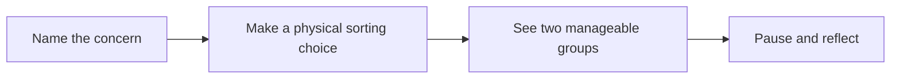

# Product & experience

[← README](../README.md) · [Architecture](architecture.md) · [Development](development.md) · [Design QA](../design-qa.md)

## The problem

Under stress, people can blur the lines between what they can control and what they cannot. Concerns become entangled, feeding a loop of overthinking that can leave a person feeling overwhelmed.

Tooca is designed around one immediate need: **help me separate these thoughts so I can approach them one at a time.**

## Target audience

| Audience | Immediate context | Intended value |
| :--- | :--- | :--- |
| Working professionals | An interview, deadline, difficult conversation, or unanswered message | A short pause to distinguish personal actions from uncertain outcomes |
| Students | A presentation, workload, application, or social concern | A simple way to name worries and decide what deserves attention now |

## The approach

Tooca adapts the **Circle of Control** concept into an intuitive, game-like interaction. Users externalize a concern as a card, then physically swipe left or right to choose where it belongs. Each choice is reversible.

The interaction is intended to interrupt passive rumination by giving the user a concrete action. That mechanism is a design hypothesis; this repository does not establish that swiping reduces anxiety more effectively than other approaches.

| Principle | How it appears in Tooca |
| :--- | :--- |
| Keep the task small | One concern per card; one card at a time during sorting |
| Let the user decide | No automatic classification or right/wrong judgment |
| Allow reconsideration | **Bring it back** undoes the latest decision |
| Offer a gentle starting point | **Try with examples** adds one random concern |
| Avoid pressure | No score, timer, streak, or ranking |
| Give closure without finality | **All sorted, for now.** and **Begin again** |

## Interaction rules

| Phase | Action | Result |
| :--- | :--- | :--- |
| Add cards | Type, then press Enter or **Add another** | Trims and adds a nonempty concern; clears and refocuses the input |
| Add cards | **Try with examples** | Adds one random mock concern, excluding existing text matches regardless of case |
| Add cards | Remove a card | Deletes that card and any associated decision history |
| Add cards | Continue | Requires at least one card; opens sorting, or reflection if all cards already have categories |
| Sort cards | Swipe left / **Rest It Here** | Assigns the current card to the rest category |
| Sort cards | Swipe right / **In My Hands** | Assigns the current card to the actionable category |
| Sort cards | Release a short, slow drag | Returns the card to its neutral position without a decision |
| Sort cards | **Bring it back** | Restores the most recent decision as an unsorted card |
| Sort cards | Sort the last card | Opens reflection automatically |
| Reflection | Toggle a category | Expands or collapses that group independently |
| Reflection | **Bring it back** | Returns to sorting and undoes the latest decision |
| Reflection | **Begin again** | Clears all cards and history; returns to Add cards |
| Any phase | **Add cards** in the header | Returns to setup while retaining existing cards and categories |

The input accepts up to 240 characters. Whitespace-only input cannot be submitted. Manually entered duplicate concerns are allowed. There are 30 mock examples; the example button disables when all are already present.

## Reflection states

| Category split | Message | Mascot |
| :--- | :--- | :--- |
| Both groups contain cards | Some things are in your hands. Others can rest here for now. | Thanks |
| All cards are in your hands | These things are in your hands. You can take them one at a time. | Happy |
| All cards rest here | These things can rest here for now. You don't have to figure everything out today. | Hugging |

**In My Hands** starts expanded; **Rest It Here** starts collapsed. Each group shows its count, retains original entry order, and displays an empty-state message when needed.

## Experience boundaries

The current product covers collecting concerns, sorting, and reflection. It does not generate action plans, diagnose users, provide chat or counseling, or connect to accounts or a backend. **Rest It Here** keeps the card visible in the summary; it does not delete the concern.

For the concise user flow and information architecture, see the [README](../README.md#core-user-flow).
